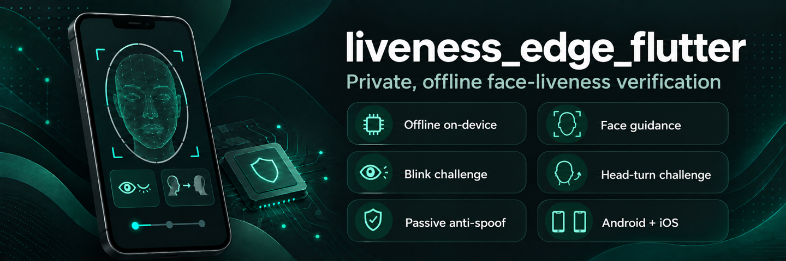

# Liveness Edge Flutter

[](https://pub.dev/packages/liveness_edge_flutter)
[](LICENSE)




Private, offline face-liveness verification for Flutter. Camera frames, face
landmarks, active challenges, and passive anti-spoofing are processed on the
device; the package does not make network requests.

## Features

- Ready-to-use camera screen with face-position guidance.
- Active blink and head-turn challenge.
- Passive presentation-attack score using MiniFASNetV2.
- Native MediaPipe Face Landmarker and ONNX Runtime processing.
- Final verified capture returned as JPEG bytes.
- Android and iOS support with bundled models; no backend required.

## Platform support

| Platform | Minimum version | Status |
| --- | ---: | --- |
| Android | API 24 | Supported |
| iOS | 15.1 | Supported |

The host device needs a front-facing camera. Desktop and web are not supported.

## Installation

Add the package to your application:

```sh
flutter pub add liveness_edge_flutter
```

Alternatively, add it directly to `pubspec.yaml`:

```yaml
dependencies:
  liveness_edge_flutter: ^0.0.1
```

### Android setup

Add camera permission to `android/app/src/main/AndroidManifest.xml`:

```xml
<uses-permission android:name="android.permission.CAMERA" />
```

Ensure the application has `minSdk` 24 or newer.

### iOS setup

Add a camera usage description to `ios/Runner/Info.plist`:

```xml
<key>NSCameraUsageDescription</key>
<string>The camera is used to verify that you are present.</string>
```

Set the application deployment target to iOS 15.1 or newer.

## Usage

Import the package and push `LivenessEdgeScreen` as a full-screen route:

```dart
import 'package:flutter/material.dart';
import 'package:liveness_edge_flutter/liveness_edge_flutter.dart';

Future<LivenessResult?> captureLiveness(BuildContext context) async {
  LivenessResult? verifiedResult;

  await Navigator.of(context).push<void>(
    MaterialPageRoute(
      builder: (routeContext) => LivenessEdgeScreen(
        configuration: const LivenessConfiguration(
          validations: {
            LivenessValidation.blink,
            LivenessValidation.headTurn,
            LivenessValidation.passiveAntiSpoof,
          },
          timeout: Duration(minutes: 2),
          maxFrames: 180,
          passiveAntiSpoofSensitivity: PassiveAntiSpoofSensitivity.high,
          faceIdentitySensitivity: FaceIdentitySensitivity.strict,
        ),
        onSuccess: (result) {
          verifiedResult = result;
          Navigator.of(routeContext).pop();
        },
        onFailed: (result) {
          debugPrint('Liveness failed: ${result.instruction}');
        },
        onCancel: () => Navigator.of(routeContext).pop(),
      ),
    ),
  );

  return verifiedResult;
}
```

On success, `result.imageBytes` contains the verified JPEG and
`result.passiveScore` contains the median passive anti-spoof score. The package
does not upload or persist either value.

All user-facing text defaults to English. Override any message through the
configuration to localize the flow or use your own product copy:

```dart
const LivenessConfiguration(
  messages: LivenessMessages(
    moveRight: 'Geser wajah ke kanan',
    moveLeft: 'Geser wajah ke kiri',
    blink: 'Kedipkan kedua mata sekali.',
    tryAgain: 'Coba lagi',
  ),
);
```

### Configuration

| Property | Default | Description |
| --- | ---: | --- |
| `validations` | All validations | Enabled checks: `blink`, `headTurn`, and/or `passiveAntiSpoof`. Face alignment and input-quality checks always run. |
| `timeout` | 2 minutes | Maximum session duration. |
| `maxFrames` | 180 | Maximum analyzed frames before failure. |
| `passiveAntiSpoofSensitivity` | `balanced` | Anti-spoof preset: `low` (0.40), `balanced` (0.50), `high` (0.60), `strict` (0.70), or `withValue(...)` for a custom value from 0 to 1. |
| `faceIdentitySensitivity` | `balanced` | Face replacement preset: `low` (0.16), `balanced` (0.10), `high` (0.06), `strict` (0.035), or `withValue(...)` for a custom value greater than 0. |
| `messages` | English `LivenessMessages` | User-facing challenge instructions and screen labels. Override individual values to localize the flow. |

Treat the default threshold as a starting point. Calibrate it using genuine
users, target devices, lighting conditions, and representative attacks.
At least one validation must be enabled. Disabled active challenges are skipped,
so their instructions are not shown. Passive sensitivity is ignored when
`passiveAntiSpoof` is disabled.

The package keeps a frozen, normalized, on-device landmark descriptor for the
first aligned face. If a different frontal face is detected in two consecutive
frames, the active challenge returns to alignment. A session cannot pass while
an identity mismatch is pending. If no valid single face is detected during an
active challenge for 400 ms, the flow also returns to alignment. Before a
challenge starts, the grace period remains two seconds.

### Callback behavior

- `onSuccess` runs once after both checks pass. It does not close the route;
  the host application controls navigation.
- `onFailed` runs once when an attempt fails because it times out, exceeds the
  frame limit, or does not pass the passive anti-spoof check. Retrying starts a
  new attempt and may invoke it again. It does not close the route.
- `onCancel` runs when the close button is pressed. When omitted, the screen
  attempts to pop its route automatically.
- A failed or timed-out session shows a retry action. Camera or model errors do
  not invoke `onFailed`, because they do not produce a final liveness result.

## How it works

### Package integration flow

The `android/` and `ios/` directories at the package root contain the native
plugin implementations that are included in every host application. The
directories with the same names under `example/` are only the Android and iOS
hosts used to run the sample application.

```text
Host application (or example/lib/main.dart)
  -> package public API (lib/liveness_edge_flutter.dart)
  -> LivenessEdgeScreen and Dart challenge state machine
  -> Flutter MethodChannel
       -> Android: android/.../LivenessEdgeFlutterPlugin.kt
       -> iOS:     ios/Classes/LivenessEdgeFlutterPlugin.swift
  -> MediaPipe Face Landmarker + ONNX Runtime
  -> LivenessResult returned to the host application
```

The relevant package layout is:

```text
liveness_edge_flutter/
├── lib/                 public API and Dart implementation
├── android/             native Android plugin implementation
├── ios/                 native iOS plugin implementation
└── example/
    ├── lib/             sample Flutter application
    ├── android/         Android host for the sample
    └── ios/             iOS host for the sample
```

### Frame processing flow

```text
Flutter camera frame
  -> upright, downsampled BGR frame
  -> MediaPipe Face Landmarker (bounds, blink, and head yaw)
  -> MiniFASNetV2 through ONNX Runtime (passive live score)
  -> challenge state machine (align, blink, turn, return)
  -> LivenessResult
```

Models are bundled with the native Android and iOS implementations. Processing
stays in application memory unless the host application stores or transmits the
returned image.

## Security and privacy

Client-side liveness is not tamper-proof. Do not use `result.passed` as the sole
authorization for banking, e-KYC, account recovery, or another high-risk server
transaction. For those flows, combine local inference with a server-issued
nonce, platform attestation, replay protection, and a trusted server-side
decision.

The passive model primarily targets printed-photo and screen-replay attacks. It
has not been validated by this project against masks, 3D attacks, camera
injection, rooted devices, or modified applications. The host application is
responsible for consent, retention, logging, screenshots, backups, and privacy
disclosures.

Review the licenses and suitability of MediaPipe, ONNX Runtime, and the bundled
MiniFASNetV2 model before commercial distribution.

## Troubleshooting

- **Camera permission denied:** request permission through the normal platform
  flow and ensure the manifest or plist entry above is present.
- **Front camera unavailable:** the capture screen reports an error and allows
  retrying; use a physical device with a front-facing camera.
- **Frequent passive failures:** test representative lighting and devices before
  lowering `passiveAntiSpoofSensitivity`; lower values increase spoof
  acceptance risk.
- **Simulator or emulator:** camera and native inference behavior can differ
  from physical hardware, so release validation should use real devices.

## Example and development

See [`example/lib/main.dart`](example/lib/main.dart) for a runnable integration.

```sh
flutter analyze
flutter test
cd example
flutter run
```

Bug reports and feature requests are welcome in the project
[issue tracker](https://github.com/nicolafeby/liveness/issues).
